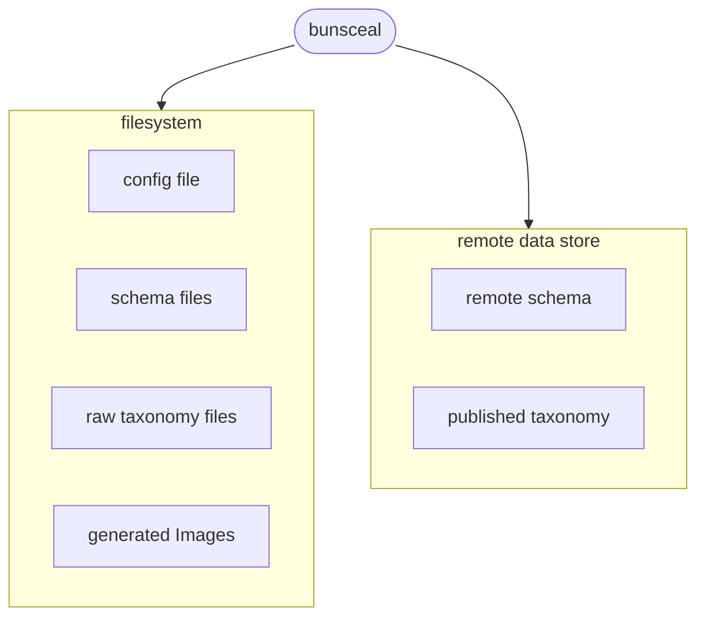
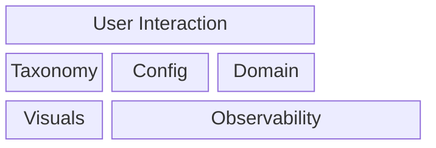

# Code Architecture

Overview of the code architecture.

## Logic overview

1. Load config and schema
2. Load taxonomy files
3. validate taxonomy file content
4. cross validate taxonomy
5. metadata validation and logic
6. publishing and image generation

**Package Domains:**

| Domain | Purpose | Interacts with |
|-------|---------|------------|
| **CMD** | User Interaction, via the CLI  | Visualisations, Taxonomy, Config, O11y |
| **Domain**| Define the scheama and associated data types| O11y|
| **Taxonomy** | Business logic, use cases | Domain, Config, O11y|
| **Visualisation** | Generates visuals based on  | Domain, Config, O11y |
| **Observability** | Handles logging and metrics |  |
| **Config** | Handles configuration and providing configuration data to other packages ||

### Notes

#### Schema Validation

Schema validation is complied at the application level for taxonomy and passed to the infrastructure functions as a point. This saves duplicate compliation resources. Schema validation should only happen at the infrastructure level, application level assumes pre validated data.
