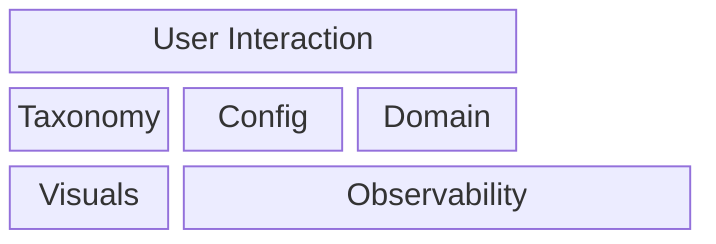

# Code Architecture

Overview of the code architecture.

**Package Domains:**

| Domain | Purpose | Interacts with |
|-------|---------|------------|
| **CMD** | User Interaction, via the CLI  | Visualisations, Taxonomy, Config, O11y |
| **Domain**| Define the schema and associated data types| O11y|
| **Taxonomy** | Business logic, use cases | Domain, Config, O11y|
| **Visualisation** | Generates visuals based on  | Domain, Config, O11y |
| **Observability** | Handles logging and metrics |  |
| **Config** | Handles configuration and providing configuration data to other packages ||

### Schema Validation

Schema validation is compiled at the application level for taxonomy and passed to the infrastructure functions as a point. This saves duplicate compilation resources. Schema validation should only happen at the infrastructure level, application level assumes pre validated data.

## Domain

Definition of core data types for building the taxonomy.

> **Core fields**:
> To decouple the core functionality of mapping out segments from extra metadata. Core fields are all excluding `labels`

## Taxonomy

List of components under the taxonomy package

### Layer: Application

#### Repository

Interface for repository functions to abstract infrastructure details on data access

Responsibilities for repository:

This includes:

- Schema validation (json schema)
- PostLoad() method
    - Schema validation (code based validation rules)
    - Setting defaults
    - Field extraction (e.g labels)

#### Service

Purpose: Take individual list of segments and form a map

- Identifier uniqueness Validation

#### taxonomy

Purpose: Population of the taxonomy object and application of business logic on core field
Build the taxonomy Object

#### Plugin

Handle everything outside of the core taxonomy fields
- Plugin Logic
    - Inheritance
    - Business Logic

## L2-L1 Override Model

L2 segments can belong to multiple L1 parents, creating an "inverse tree" structure:

**Per-Parent Overrides**: Each L2-L1 relationship can specify different label values via `l1_overrides[parent_id]`. These overrides define the child's **effective value** when validated against that specific parent.

**Precedence**:
- Validation: override > child base value
- Inheritance: parent → child (only fills gaps, never touches overrides)
